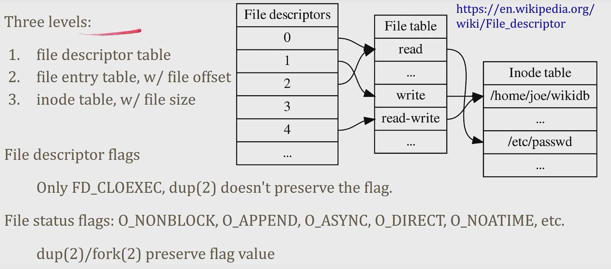

# 文件操作

1. open/close/(creat)
2. read/write/seek
3. fstat/ftruncate
4. unlink/mkdir/dup

inode:是文件系统的核心表示

必须有

1. mode(type+permissions)
2. size in bytes
3. reference count(nlink)
4. block addresses

不必须有的

1. file name

操作

* timestamp(atime,ctime,mtime)
* uid/gid
* minor/major device numbers

inode number is unique within one filesystem

* hard-link can't cross filesystem
* soft-link (symbolic link ) can

打开文件进行的操作

[https://zhuanlan.zhihu.com/p/34280875](https://zhuanlan.zhihu.com/p/34280875)

<figure><figcaption>
打开文件进行的操作
</figcaption></figure>

进程文件表中的一个entry对应的是 \[fd flags,file pointer ]

fd就是那个proc目录下的

当两个进程读取同一个文件的时候，Linux文件系统做的事情

服务进程对access.log文件进行写入操作

这时候，用户想要对access.log进行实时查看 `less access.log`

<figure><figcaption></figcaption></figure>

每一个进程都会创建基于该文件的 `file table entry`

current file offset每个进程都可以不同，但是current file size大小是相同的。

Linux文件描述符有三个层次

1. 文件描述表
2. 文件记录表，包含文件偏移量
3. inode table，包含文件大小

<figure><figcaption></figcaption></figure>

**当你对一个文件使用`Open()`方法调用两次和`Open(2)`一次然后`dup(2)`或者`fork(2)`的区别是什么？**

* 文件描述符属于进程的，但是文件表和inode表是属于全局的
* 文件当前的偏移量在文件表中，当前的文件大小在inode 表中
* 一样的 inode ,当修改文件状态的时候，就要获取一样的lock
* 使用两次`Open(2)`两个文件表记录表，每一个文件描述符都有自己的偏移量，没有干涉
* 执行`Open(2)`后执行`dup(2),`一个文件entry表，两个文件描述符指针指向同一个文件对象
* `dup()`**dup会申请一个fd来指向一个已经存在的file table**
* 执行`Open(2)`后执行`fork(2),`两个文件描述符指针指向同一个文件对象，共享一样的偏移量，共享偏移量是指，当父进程在1k的地方写了1k，那么子进程在写1k，会在2k的位置写，总文件大小会在最后变成3k
* fork会创建子进程，fork会用不同进程表的相同文件描述符，来指向同一个文件entry，文件计数会=2，如果想要释放掉该file table，必须父子进程都执行close

[https://blog.csdn.net/R\_g\_Luo/article/details/90145631?spm=1001.2101.3001.6661.1\&utm\_medium=distribute.pc\_relevant\_t0.none-task-blog-2%7Edefault%7ECTRLIST%7ERate-1-90145631-blog-89295537.235%5Ev27%5Epc\_relevant\_recovery\_v2\&depth\_1-utm\_source=distribute.pc\_relevant\_t0.none-task-blog-2%7Edefault%7ECTRLIST%7ERate-1-90145631-blog-89295537.235%5Ev27%5Epc\_relevant\_recovery\_v2\&utm\_relevant\_index=1](https://blog.csdn.net/R\_g\_Luo/article/details/90145631?spm=1001.2101.3001.6661.1\&utm\_medium=distribute.pc\_relevant\_t0.none-task-blog-2%7Edefault%7ECTRLIST%7ERate-1-90145631-blog-89295537.235%5Ev27%5Epc\_relevant\_recovery\_v2\&depth\_1-utm\_source=distribute.pc\_relevant\_t0.none-task-blog-2%7Edefault%7ECTRLIST%7ERate-1-90145631-blog-89295537.235%5Ev27%5Epc\_relevant\_recovery\_v2\&utm\_relevant\_index=1)

<figure><figcaption></figcaption></figure>

